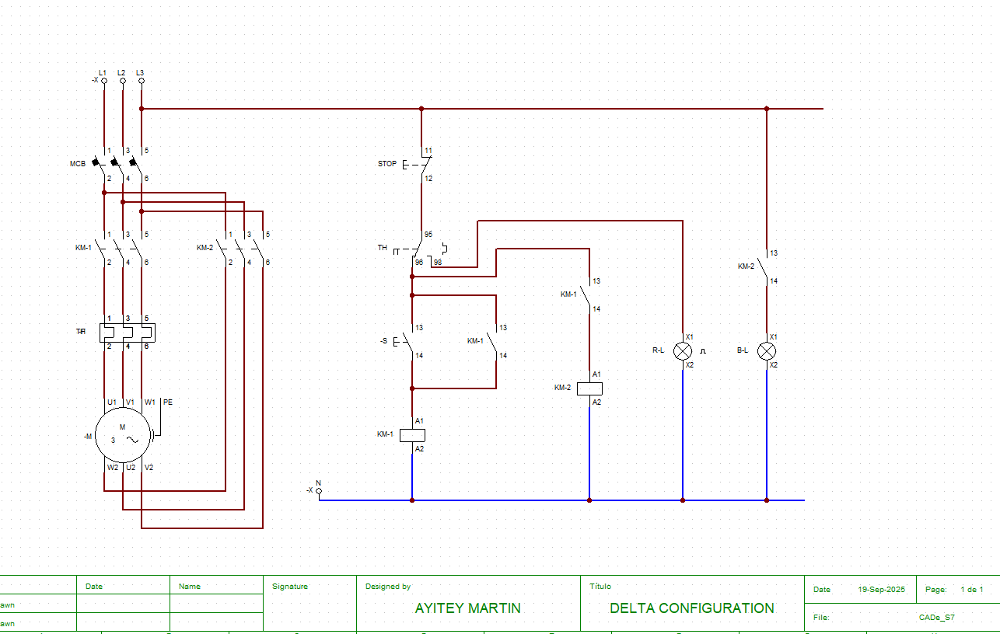

# ⚙️ Delta Configuration Motor Starter Simulation

This project simulates a **Delta Configuration Motor Starter** using [CADe_SIMU](http://cadesimu.sourceforge.net/), a graphical tool for designing and testing electrical control circuits. It demonstrates how a three-phase motor can be started using a delta connection, which reduces starting current and improves efficiency.

## 🔧 Tools & Technologies
- **Simulation Software**: CADe_SIMU
- **Components Used**: Contactors, push buttons, overload relay
- **Design Focus**: Star-to-delta transition, motor protection

## 🎯 Objective
To simulate a motor starter circuit that:
- Starts the motor in **delta configuration** to limit inrush current

## 📁 Project Files

## 🌀 Circuit Logic Overview
- **Start Button** energizes the star contactor
- **Overload Relay** protects the motor from excessive current
- **Stop Button** deactivates all contactors and resets the system

## 📸 Screenshot

## 🎥 Simulation Demo
[▶️ Watch Delta Motor Starter Simulation](https://drive.google.com/file/d/1CYj9BlhO0kmHxpTe_on4YV5Hw7RbqNjM/view?usp=sharing)

> This video demonstrates delta configuration and the motor protection logic implemented in CADe_SIMU.

## 🧠 Learning Outcomes
- Understanding of star-delta motor starting principles
- Practical use of timers and contactors in motor control
- Hands-on experience with CADe_SIMU for industrial circuit simulation

## 🙌 Credits
Designed and simulated by **Ayitey Martin**, Electrical & Electronic Engineering student at UENR, Ghana.

## 📬 Feedback & Collaboration
Feel free to fork, star ⭐, or open issues for suggestions. Contributions and improvements are welcome!

---

